<p float="left">
  
  
  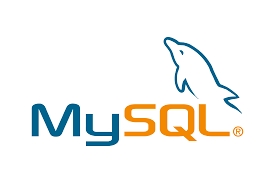
  
</p>

# 🧑‍💼 EmployeeService - CRUD API

### 🛠️ Technologies
- **Spring Boot 3**
- **MySQL**
- **Docker** (for MySQL container)
- **JWT (Future implementation)**
- **Hexagonal Architecture**
- **JDK 21**
- **JUnit & Integration Testing**
- **Postman**

---

## 📋 Project Overview

This project is a RESTful API for managing employee data, built with **Spring Boot** and **MySQL**. It follows clean architecture principles (hexagonal architecture) and supports standard CRUD operations.

---
### ✨ Features

- ✅ Create new employees
- 📄 Retrieve a list of employees
- ✏️ Update existing employee records
- ❌ Delete employees by ID
- 🧪 Tested with JUnit and Postman
- 🚀 Ready for future enhancements (e.g., JWT security, Swagger UI)


---

## 🛳️ Dockerized MySQL Database

The application uses a **MySQL database running inside a Docker container**, defined in the `docker-compose.yml` file for easy setup and portability.

### ⚙️ Docker Configuration

```yaml
services:
  mysql:
    image: mysql:latest
    container_name: my_mysql
    restart: always
    environment:
      MYSQL_ROOT_PASSWORD: sasa1234
      MYSQL_DATABASE: employee_db
    ports:
      - "3306:3306"
    volumes:
      - ./db/mysql_data:/var/lib/mysql
```
### ▶️ How to Start the Container

Make sure [Docker](https://www.docker.com/) is installed and running. Then launch the MySQL container with:

```bash
docker-compose up -d
```

---
## 🔗 API Endpoints

| Method   | Endpoint                | Description                  |
|----------|-------------------------|------------------------------|
| `GET`    | `/api/employees`        | Get all employees            |
| `POST`   | `/api/employees`        | Create a new employee        |
| `POST`   | `/api/employees/bulk`   | Create multiple employees    |
| `PUT`    | `/api/employees/{id}`   | Update an existing employee  |
| `DELETE` | `/api/employees/{id}`   | Delete employee by ID        |

### 📨 Sample `POST` Request (Single Employee)

```json
{
  "firstName": "Jose",
  "secondName": "Julian",
  "paternalLastName": "Trejo",
  "maternalLastName": "Torrez",
  "age": 36,
  "sex": "M",
  "dateOfBirth": "1985-10-20",
  "position": "Developer"
}
```
### Swagger summary 
- http://localhost:8080/swagger-ui/index.html

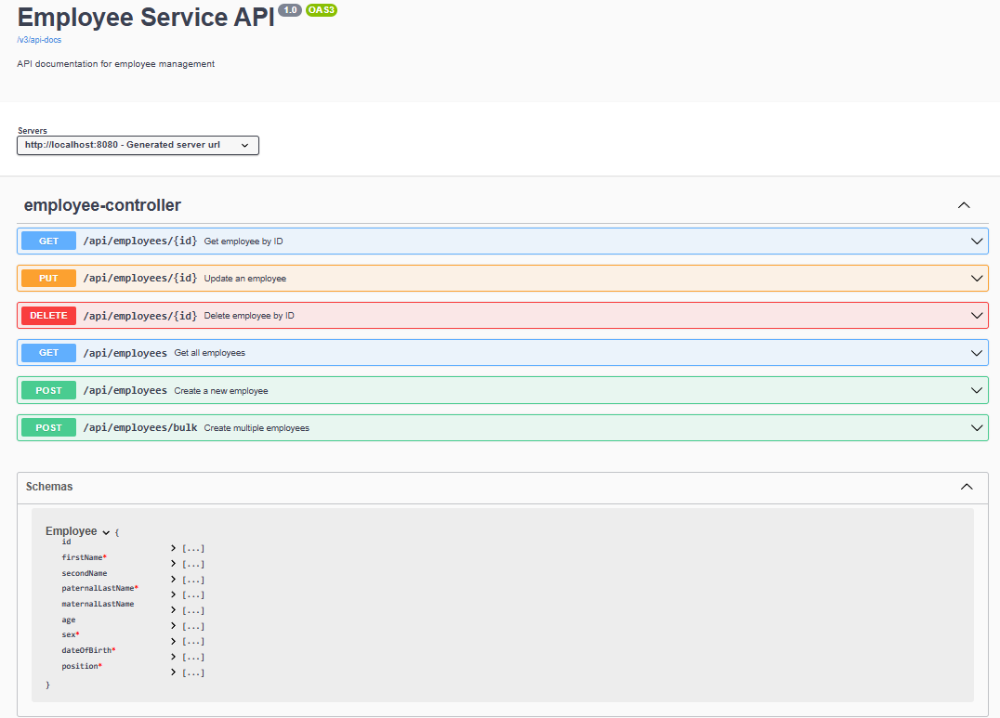


### 📋 Postman Tests by Operation

**GET all employees**  
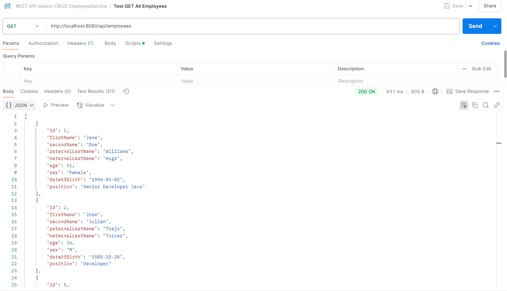

**POST create employee**  
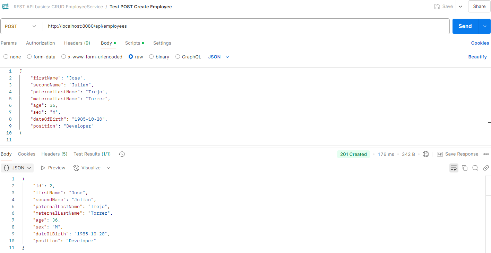

**POST bulk create employees**  
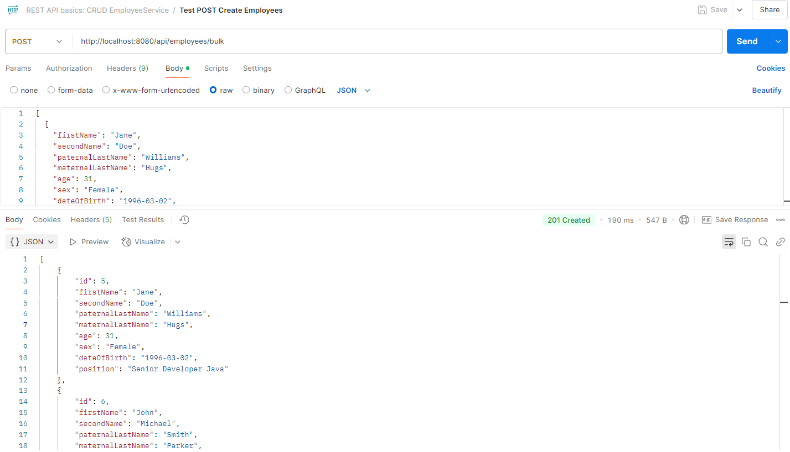

**PUT update employee**  
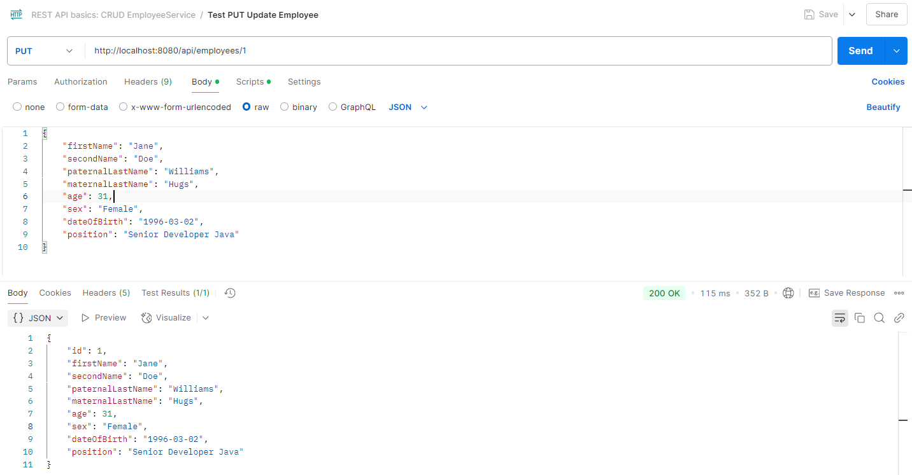

**DELETE employee**  
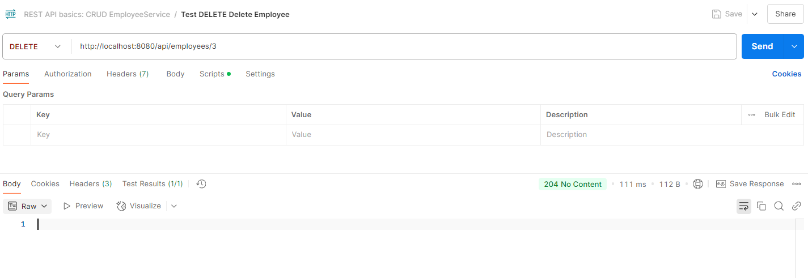

### 🗄️ Database Query Evidence with DBeaver

**SELECT all employees from the database**  
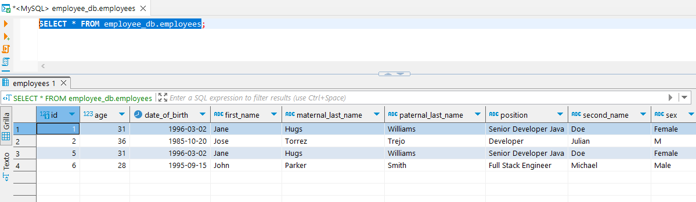

This screenshot shows the result of a `SELECT * FROM employee_db.employees` query executed in DBeaver, verifying the data stored in the MySQL database after API operations.

### 🧪 Testing Evidence

<table>
   <tr>
      <td><p>Service Test</p></td>
      <td><p>Controller Test</p></td>
   </tr>
   <tr>
      <td>
         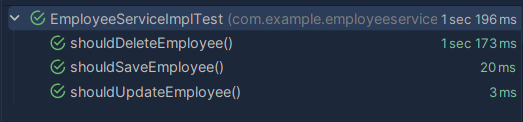
      </td>
      <td>
         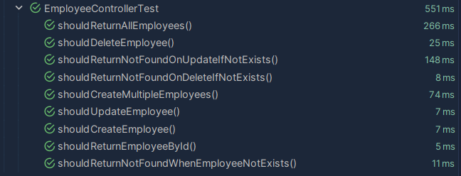
      </td>
   </tr>
   <tr>
      <td colspan="2"><p>All Test</p></td>
   </tr>
   <tr>
      <td colspan="2">
         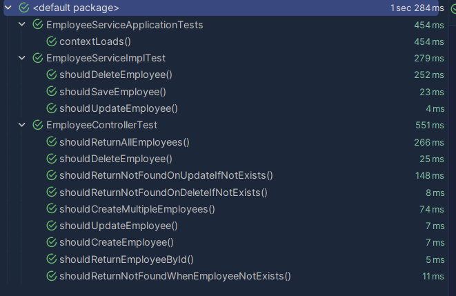
      </td>
   </tr>
</table>

